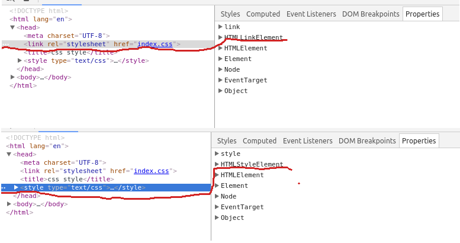
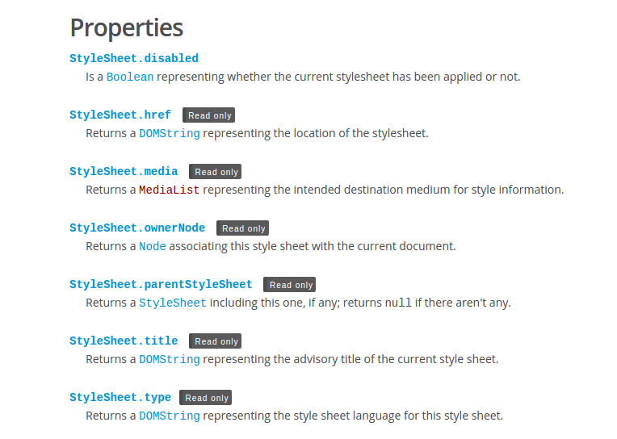
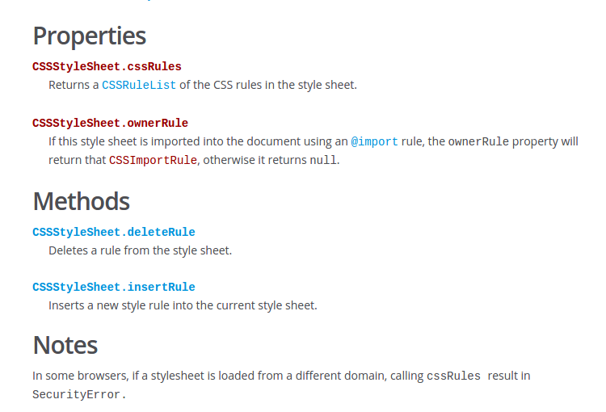

## css style text

在学习制作flexbox学习的demo时,有获取文档中link css的需求,在仔细学过程中,来点总结以温故!

都知道,css文件有3种不同引入方法: 粗暴如inline style, 直接如style in head, 专业如link.学习过程中,受益很大,碰到了问题,问谷歌,查书,很遗憾,最终还是有一个问题没有
搞清楚,终极办法,上overstackflow提问,看看大神们能否给点提示,果然,很快就有人帮了我一把,但结果却让人无奈伤心(啊哈哈)!

### inline style

三种方式中,这个是最容易理解如何获取css rule的,我先来总结.总结,inline css实际上是元素的一个特性,一个全局特性(Global attribute),很多HTML元素都是支持的,如果是简单的css效果,万般无奈下,用用也无妨的,我们来看问题:

+ 获取css text

		

		
how to accese of doument's css!

		

		p {
		color: red;
		}

我们有如上的HTML,简单的结构,那么问题来了,如何能获取*color:red;*呢?

	var cssInline = document.getElementById('demo').style;
	var cssInText = cssInline.cssText, 
	cssColor = cssInline.color;

	console.log(cssInText, cssColor);

稍作解释: 获取目标元素-->获取目标元素style属性-->获取style属性的cssText属性-->获取cssText属性中的特定规则.

稍微深入的学习: 

> 任何支持style特性的HTML元素在Javascript中都有一个对应的style属性,这个style对象是CSSStyleDeclaration的实例,包含着通过HTML的style特性制定的所有样式,但是不包括外部样式和经嵌入层叠而来的样式.在style特性中指定的任何属性都将表现为这个style对象的相应属性,对于带分隔符的css属性名,采用驼峰命名,例外一个,float是Javascript的保留字,不能直接访问,采用cssFloat或者styleFloat(IE).

上段文字出自高程(第三版),书翻译得很好,我是能看懂的,style特性有个style属性,这个属性是CSSStyleDeclaration的一个实例.但不包含外部引入和嵌入样式,通过这个方法,可获取,修改,新增样式.

### 嵌入样式表(style)

CSSStyleSheet类型表示的样式表,包括link和style元素中定义的样式表,link和style样式表分别是HTMLLinkElement和HTMLStyleElement类型表示的,有图为证:

而CSSStyleSheet是指样式表,不管它存在的形式,一般更加通用点,CSSStyleSheet继承于StyleSheet,继承并拥有自己的属性和方法

更加详细资料可查询[MDN-CSSStyleSheet](https://developer.mozilla.org/en-US/docs/Web/API/CSSStyleSheet),[MDN-StyleSheet](https://developer.mozilla.org/en-US/docs/Web/API/StyleSheet).

应用于文档的所有样式表是通过document.styleSheets集合表示的,lenght属性获知样式表个数,方括号和item()方法访问每一个样式表,也可以直接获取link或style元素的CSSStyleSheet对象,它的sheet(styleSheet IE)属性而访问对应样式表对象.

获取样式表的下一个步骤就是通过样式表对象的属性和方法来读取和操作样式,其中cssRule对象表示样式表中的每一条规则,cssRule是一个供其他多种类型集成的基类,其中最常见的就是CSSStyleRule类型,表示样式信息,CSSStyleSheet对象包括:

> cssText: 返回整条规则对应的文本,只读
> selectorText: 当前规则的选择符文本
> style: 一个CSSStyleDeclaration对象
	> style.cssText : 和上述cssText不同,可读可写,但文本中不包括"{}".
	> style.css属性名: backgroundColor,驼峰表示

一般应用下,style就可以满足需求了.

说会正题,那到底如何操作呢?

	/*2.a to get the style in head*/
	var cssInHeada = document.getElementById('demo');
	// using the computed css of inline
	var cssHeadText = getComputedStyle(cssInHeada, null);
	console.log(cssHeadText);

	// 2.b to get the style directly
	var cssInHeadb = document.getElementsByTagName('style')[0];
	console.log(cssInHeadb.textContent);

	// 2.c or like this
	var cssInHeadc = document.styleSheets[1];
	console.log(cssInHeadc.cssRules[0].cssText); //per rule

	/*3, but I cant get the extenal style*/
	var cssExtenal = document.styleSheets[0];
	console.log(cssExtenal.cssRules[0].cssText);

总结:外部引入和内嵌样式表的获得:**StyleSheets-->StyleSheets\[i](.itme(i))-->cssRules[i]-->cssText**.

说人话就是:先获得全部样式表(*集合*),在获取单个样式表(*样式规则集合*),接着就是单条样式,最后就是样式文本.

提一点:学习过程中,遇到一个狗血的事情,本来应该没什么问题的,但是因为开发时候用的是chromium浏览器测试,一直不能获取我要的样式表,最后发现是浏览器问题,看[这里}(https://code.google.com/p/chromium/issues/detail?id=49001)换成FF就没问题了,浪费我好多时间,还去[overstackflow-how-to-get-external-css-text](http://stackoverflow.com/questions/34879704/how-to-get-the-csstext-of-external-style/34879994#34879994)提问了,感谢帮助.

学习过程,大感知识匮乏,战斗还是开始阶段,加油!

	p {
	color: red;
	}
